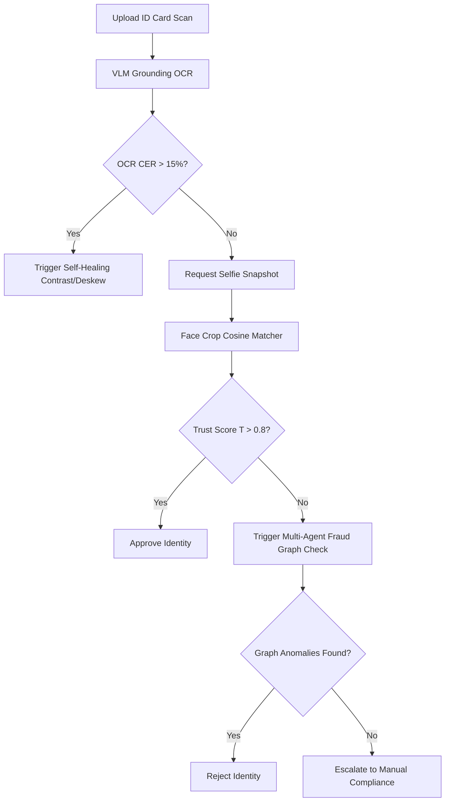

# 🛡️ IdentityGuardian AI: Self-Healing Adaptive KYC Node

IdentityGuardian AI is an academic research platform for Know-Your-Customer (KYC) identity verification, optical character recognition (OCR), multi-agent fraud graph networks, and Vision-Language Model (VLM) parameter-efficient adapters.

## 📖 Publications & Research Documentation
- **Academic Research Draft**: Read the formal publication paper in [RESEARCH_PAPER.md](docs/RESEARCH_PAPER.md)
- **Literature Review & Dataset Card**: Read the comprehensive VLM and Graph AML survey in [LITERATURE_REVIEW.md](docs/LITERATURE_REVIEW.md)

---

## 🛠️ Architecture Overview

The system models the verification pipeline as an adaptive decision trail, dynamically routing files based on a joint trust score computed at runtime.



---

## ⚙️ Setup & Reproducibility Guide

### 1. Installation
Clone the repository and install all dependencies:
```bash
git clone https://github.com/Parvinder10/IdentityGuardian-AI.git
cd IdentityGuardian-AI
pip install -r requirements.txt
```

### 2. Dataset Formats
Ensure your layout grounding datasets are in JSON Lines formatting inside `./data/annotations.jsonl`:
```json
{"image": "id_001.png", "suffix": "<OD>", "label": "name [340, 210, 480, 520]"}
{"image": "id_002.png", "suffix": "<OD>", "label": "dob [120, 220, 240, 410]"}
```

### 3. VLM Fine-Tuning Execution
Run parameter-efficient LoRA SFT on open-weight VLMs:
```bash
python src/training/train_vlm.py \
    --model_name "Florence-2" \
    --peft_method "LoRA" \
    --lr 0.0003 \
    --epochs 5 \
    --lora_r 16 \
    --lora_alpha 32
```

### 4. Distributed Multi-GPU Training Launcher
Launch scalable training sweeps using DeepSpeed ZeRO-2 optimization and gradient checkpointing:
```bash
accelerate launch \
    --multi_gpu \
    --mixed_precision fp16 \
    --use_deepspeed \
    --deepspeed_config_file ./deepspeed_config.json \
    src/training/train_vlm.py \
    --gradient_checkpointing
```

### 5. Running the Test Suite
Execute the entire testing suite containing all 35 unit tests:
```bash
python -m pytest
```

---

## 🔬 Technical Blog: Adapting Document Intelligence

Modern KYC systems suffer from poor generalization because real-world document photos include shadows, rotations, and folds. 

### Resolving Shadows and Blur
Rather than requesting users to restart their uploads (which triggers high drop-off rates), **IdentityGuardian AI** uses a self-healing cascade. When character extraction confidence scores drop below threshold boundaries, the pipeline triggers contrast-enhancing histograms (CLAHE) and Hough-line deskewers to recover correct bounding box spatial targets.

### Tracking with W&B, MLflow, and TensorBoard
Every training run is tracked across MLflow, Weights & Biases (W&B), and TensorBoard logs. In addition, runs are logged locally as structured JSON entries inside `./runs/` to guarantee reproducibility across different environments.
